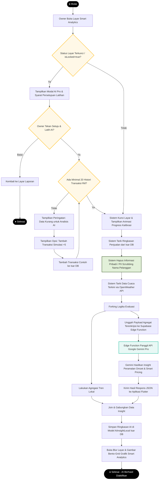

```mermaid
flowchart TD
    Start([● Mulai]) --> OpenPOS[Kasir Buka Layar Kasir / POS Screen]
    OpenPOS --> BrowseProducts[Kasir Pilih Produk / Scan Barcode SKU]
    BrowseProducts --> AddToCart[Masukkan Produk ke Keranjang Belanja]
    
    AddToCart --> VerifyCart{Keranjang Selesai?}
    VerifyCart -- Tidak --> BrowseProducts
    VerifyCart -- Ya --> OpenCartSheet[Kasir Buka Lembar Keranjang / Cart Sheet]
    
    OpenCartSheet --> CheckDiscount{Gunakan Voucher?}
    CheckDiscount -- Ya --> InputVoucherCode[Input Kode Voucher & Validasi]
    InputVoucherCode --> ApplyDiscount[Sistem Potong Total Tagihan]
    ApplyDiscount --> CheckSplitBill
    CheckDiscount -- Tidak --> CheckSplitBill{Lakukan Split Bill?}
    
    CheckSplitBill -- Ya --> OpenSplitBillScreen[Kasir Buka Layar Split Bill]
    OpenSplitBillScreen --> SelectSplitItems[Pilih Item & Alokasikan ke Pelanggan]
    SelectSplitItems --> ProcessIndividualPay[Proses Pembayaran Per Bagian]
    ProcessIndividualPay --> CheckAllPaid{Semua Bagian Lunas?}
    CheckAllPaid -- Belum --> SelectSplitItems
    CheckAllPaid -- Ya --> SaveLocalDB
    
    CheckSplitBill -- Tidak --> ChoosePaymentMethod[Pilih Metode Pembayaran]
    ChoosePaymentMethod --> InputPaymentAmount[Input Nominal Uang Diterima]
    InputPaymentAmount --> ConfirmPay[Sistem Validasi & Hitung Kembalian]
    ConfirmPay --> SaveLocalDB[Simpan Transaksi di Isar DB Lokal]
    
    SaveLocalDB --> DecrStock[Sistem Kurangi Stok Produk di Isar DB]
    DecrStock --> TriggerPrintReceipt{Cetak Struk Fisik?}
    
    TriggerPrintReceipt -- Ya --> PrintReceipt[Cetak Struk via Bluetooth Printer]
    PrintReceipt --> ShowSuccessDialog
    TriggerPrintReceipt -- Tidak --> ShowSuccessDialog[Tampilkan Dialog Transaksi Sukses]
    
    ShowSuccessDialog --> End([● Selesai])

    %% Styles
    style Start fill:#000,stroke:#333,color:#fff
    style End fill:#000,stroke:#333,color:#fff
    style VerifyCart fill:#fff8e7,stroke:#ffb700,stroke-width:2px
    style CheckDiscount fill:#fff8e7,stroke:#ffb700,stroke-width:2px
    style CheckSplitBill fill:#fff8e7,stroke:#ffb700,stroke-width:2px
    style CheckAllPaid fill:#fff8e7,stroke:#ffb700,stroke-width:2px
    style TriggerPrintReceipt fill:#fff8e7,stroke:#ffb700,stroke-width:2px
    style SaveLocalDB fill:#e2f0d9,stroke:#385723,stroke-width:2px
```

```mermaid
flowchart TD
    Start([● Trigger Sync: Koneksi Pulih / Manual]) --> InitSync[Aktifkan SyncNotifier Provider]
    InitSync --> CheckNetwork{Koneksi Internet Aktif?}
    
    CheckNetwork -- Tidak --> ShowOfflineToast[Tampilkan Status Offline & Batalkan Sinkronisasi]
    ShowOfflineToast --> EndOffline([● Selesai - Mode Luring Tetap Aktif])
    
    CheckNetwork -- Ya --> CheckUnsyncedCategories{Ada Kategori Unsynced/isSynced=false?}
    
    %% Kategori Loop
    CheckUnsyncedCategories -- Ya --> PushCategories[Upload Kategori Baru/Ubah ke Supabase via Upsert]
    PushCategories --> MarkCategoriesSynced[Setel isSynced=true & Hapus local flag isDeleted]
    MarkCategoriesSynced --> CheckUnsyncedProducts
    CheckUnsyncedCategories -- Tidak --> CheckUnsyncedProducts{Ada Produk Unsynced/isSynced=false?}
    
    %% Produk Loop
    CheckUnsyncedProducts -- Ya --> PushProducts[Upload Produk & Mutasi Stok ke Supabase]
    PushProducts --> MarkProductsSynced[Setel Produk isSynced=true di Isar DB]
    MarkProductsSynced --> CheckUnsyncedTx
    CheckUnsyncedProducts -- Tidak --> CheckUnsyncedTx{Ada Transaksi Unsynced?}
    
    %% Transaksi Loop
    CheckUnsyncedTx -- Ya --> ProcessTransactions[Ambil Daftar Nota Transaksi & Item Terkait dari Isar]
    ProcessTransactions --> BatchUploadTx[Batch Upload ke Tabel transactions & transaction_items Supabase]
    BatchUploadTx --> MarkTxSynced[Setel isSynced=true pada Transaksi Lokal di Isar]
    MarkTxSynced --> CheckDeletedItems
    CheckUnsyncedTx -- Tidak --> CheckDeletedItems{Ada Data Ditandai isDeleted=true?}
    
    %% Hapus Bersih
    CheckDeletedItems -- Ya --> SyncDeleteCloud[Kirim Perintah Hapus Permanen ke Supabase]
    SyncDeleteCloud --> CleanLocalDb[Hapus Baris Terkait dari Isar DB Lokal]
    CleanLocalDb --> ShowSuccessToast
    CheckDeletedItems -- Tidak --> ShowSuccessToast[Tampilkan Toast: Data Berhasil Disinkronkan]
    
    ShowSuccessToast --> EndOnline([● Selesai - Sinkronisasi Cloud Sukses])

    %% Styles
    style Start fill:#000,stroke:#333,color:#fff
    style EndOffline fill:#000,stroke:#333,color:#fff
    style EndOnline fill:#000,stroke:#333,color:#fff
    style CheckNetwork fill:#fff8e7,stroke:#ffb700,stroke-width:2px
    style CheckUnsyncedCategories fill:#fff8e7,stroke:#ffb700,stroke-width:2px
    style CheckUnsyncedProducts fill:#fff8e7,stroke:#ffb700,stroke-width:2px
    style CheckUnsyncedTx fill:#fff8e7,stroke:#ffb700,stroke-width:2px
    style CheckDeletedItems fill:#fff8e7,stroke:#ffb700,stroke-width:2px
    style CleanLocalDb fill:#fce4d6,stroke:#c65911,stroke-width:2px
```

# Dokumentasi Activity Diagram (Diagram Aktivitas)
**Aplikasi: Parzello POS Mobile (ZelloPOS)**  
**Tanggal Penyusunan: 1 Juni 2026**

---

## Pendahuluan

Dokumen ini menyajikan rancangan **Activity Diagram (Diagram Aktivitas)** untuk sistem **Parzello POS Mobile**. Pemodelan *Activity Diagram* sangat krusial dalam rekayasa perangkat lunak untuk memvisualisasikan aliran kerja dinamis (*dynamic workflow*), logika prosedural, titik percabangan keputusan (*decision nodes*), serta proses konkuren (*fork/join*) yang terjadi di dalam aplikasi.

Dalam dokumen ini, diagram aktivitas dibagi menjadi tiga alur kerja utama yang paling representatif terhadap kecanggihan arsitektur sistem:
1.  **Alur Kerja Transaksi Kasir (POS Checkout Workflow)**: Menggambarkan langkah pelayanan kasir dari input barang hingga pencetakan struk.
2.  **Alur Kerja Sinkronisasi Data Latar Belakang (Offline-First Sync Engine)**: Menjelaskan logika deteksi luring/daring dan sinkronisasi otomatis.
3.  **Alur Kerja Kalibrasi AI Smart Analytics**: Menguraikan alur validasi transaksi, enkripsi/masking PII, pemanggilan Gemini API, hingga visualisasi hasil proyeksi.

---

## 1. Activity Diagram: Alur Kerja Transaksi Kasir (POS Checkout)

Diagram ini menggambarkan alur kerja kasir/owner dalam memproses transaksi belanja pelanggan di kasir, termasuk opsi penerapan kupon dan pemisahan tagihan (*split bill*).

### Visualisasi Mermaid Flowchart

---

## 2. Activity Diagram: Sinkronisasi Latar Belakang (Offline-First Sync Engine)

Diagram ini mengilustrasikan logika *state machine* dari `SyncNotifier` dalam mendeteksi koneksi dan melakukan sinkronisasi data luring lokal ke database cloud Supabase secara otomatis dan aman.

### Visualisasi Mermaid Flowchart

---

## 3. Activity Diagram: Proses Kalibrasi AI Smart Analytics (Gemini AI)

Diagram aktivitas ini menggambarkan alur permohonan analisis bisnis cerdas oleh Owner, proses penyaringan keamanan privasi data pelanggan, pemanggilan model AI, hingga hasil analisis divisualisasikan.

### Visualisasi Mermaid Flowchart

---

## Penjelasan Simbol Pemodelan Diagram Aktivitas

Untuk mempermudah penjelasan sidang akademis (skripsi), berikut adalah keterangan simbol representasional yang digunakan pada diagram di atas:

1.  **Initial Node (● Mulai)**: Titik awal dimulainya aktivitas atau workflow.
2.  **Action/Activity State (Kotak Sudut Bulat)**: Langkah kerja atau tugas operasional yang dieksekusi oleh aktor atau sistem.
3.  **Decision Node (Belah Ketupat / Diamond)**: Evaluasi kondisi bersyarat yang menghasilkan jalur keluaran berbeda berdasarkan jawaban boolean (Ya/Tidak).
4.  **Fork Node (Pemisahan)**: Pembagian jalur tunggal menjadi dua atau lebih aktivitas konkuren/independen yang berjalan bersamaan (seperti pemanggilan API Cloud sembari memproses agregasi data secara lokal).
5.  **Join Node (Penggabungan)**: Menyatukan kembali beberapa aktivitas konkuren sebelum melangkah ke proses akhir.
6.  **Final Node (● Selesai)**: Titik akhir selesainya seluruh aktivitas dalam workflow terkait.
