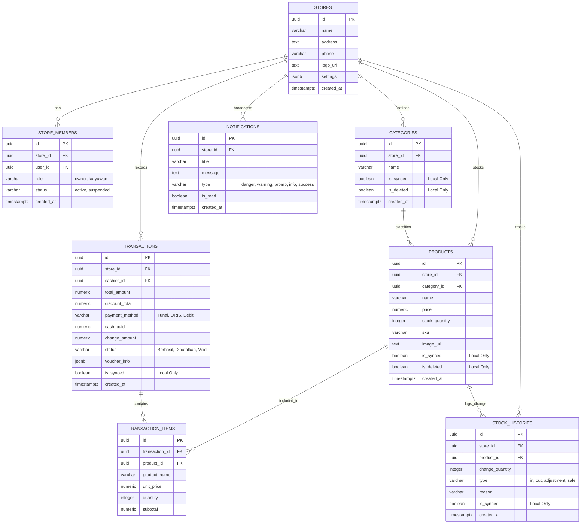

# Entity Relationship Diagram (ERD) & Kamus Data
**Aplikasi: Parzello POS Mobile (ZelloPOS)**  
**Platform: Supabase PostgreSQL (Cloud) & Isar Database (Local Cache)**  
**Tanggal Penyusunan: 1 Juni 2026**

---

## Pendahuluan

Dokumen ini merinci rancangan basis data relasional (**Entity Relationship Diagram - ERD**) untuk aplikasi **Parzello POS Mobile**. Arsitektur database aplikasi ini didesain secara hibrida, di mana skema relasional di **Supabase PostgreSQL (Cloud)** direplikasi secara cerdas di dalam **Isar DB (Database Lokal Client)** untuk mendukung ketahanan operasional *offline-first*.

Beberapa tabel lokal memiliki atribut tambahan pelacakan sinkronisasi (`is_synced` dan `is_deleted`) untuk menjaga integritas data saat terjadi pertukaran data di latar belakang.

---

## Diagram ERD (Mermaid Diagram)

Diagram berikut digambar menggunakan format **Mermaid erDiagram** untuk menggambarkan entitas, atribut (beserta tipe data), kunci utama (PK), kunci tamu (FK), serta hubungan kardinalitas antartabel.

---

## Kamus Data Terperinci (Data Dictionary)

Berikut adalah detail kolom, tipe data, kendala (*constraints*), serta deskripsi fungsional untuk setiap entitas dalam sistem Parzello POS:

### 1. Tabel: `stores`
Menyimpan informasi identitas dasar outlet/toko merchant.

| Nama Kolom | Tipe Data | Kendala | Deskripsi |
| :--- | :--- | :--- | :--- |
| `id` | UUID | PRIMARY KEY | ID Unik global toko. |
| `name` | VARCHAR(255) | NOT NULL | Nama toko/outlet. |
| `address` | TEXT | NULLABLE | Alamat fisik toko. |
| `phone` | VARCHAR(20) | NULLABLE | Nomor telepon toko. |
| `logo_url` | TEXT | NULLABLE | URL gambar logo toko di Supabase Storage. |
| `settings` | JSONB | NOT NULL | Pengaturan operasional (tipe ritel, fitur aktif, kapasitas default meja). |
| `created_at` | TIMESTAMPTZ | DEFAULT now() | Waktu pendaftaran toko. |

### 2. Tabel: `store_members`
Menyimpan hubungan hak akses anggota staf terhadap suatu toko (untuk penegakan RBAC).

| Nama Kolom | Tipe Data | Kendala | Deskripsi |
| :--- | :--- | :--- | :--- |
| `id` | UUID | PRIMARY KEY | ID Unik member staf. |
| `store_id` | UUID | FK -> `stores.id` | Menghubungkan staf dengan tokonya. |
| `user_id` | UUID | FK -> `auth.users` | Menghubungkan dengan ID autentikasi Supabase Auth. |
| `role` | VARCHAR(50) | NOT NULL | Peran staf: `'owner'` (pemilik) atau `'karyawan'` (kasir/staf). |
| `status` | VARCHAR(50) | DEFAULT 'active' | Status keanggotaan: `'active'` atau `'suspended'`. |
| `created_at` | TIMESTAMPTZ | DEFAULT now() | Waktu penambahan staf ke toko. |

### 3. Tabel: `categories`
Kategori pengelompokan produk makanan/barang dagangan.

| Nama Kolom | Tipe Data | Kendala | Deskripsi |
| :--- | :--- | :--- | :--- |
| `id` | UUID | PRIMARY KEY | ID Unik kategori. |
| `store_id` | UUID | FK -> `stores.id` | Kepemilikan kategori per toko. |
| `name` | VARCHAR(255) | NOT NULL | Nama kategori (contoh: *Makanan*, *Minuman*). |
| `is_synced` | BOOLEAN | *Isar Local Only* | Penanda sinkronisasi database lokal ke cloud. |
| `is_deleted` | BOOLEAN | *Isar Local Only* | Flag *soft delete* lokal sebelum dihapus permanen di cloud. |
| `created_at` | TIMESTAMPTZ | DEFAULT now() | Waktu pembuatan kategori. |

### 4. Tabel: `products`
Katalog produk barang atau makanan/minuman yang dijual.

| Nama Kolom | Tipe Data | Kendala | Deskripsi |
| :--- | :--- | :--- | :--- |
| `id` | UUID | PRIMARY KEY | ID Unik produk. |
| `store_id` | UUID | FK -> `stores.id` | Kepemilikan produk per toko. |
| `category_id` | UUID | FK -> `categories.id` | Kategori produk (dapat bernilai NULL/Tanpa Kategori). |
| `name` | VARCHAR(255) | NOT NULL | Nama menu/produk. |
| `price` | NUMERIC(12,2) | NOT NULL | Harga jual produk. |
| `stock_quantity`| INTEGER | DEFAULT 0 | Jumlah stok barang saat ini. |
| `sku` | VARCHAR(100) | NULLABLE | Kode SKU/Barcode produk untuk scan kamera native. |
| `image_url` | TEXT | NULLABLE | Foto produk yang tersimpan di Supabase Storage. |
| `is_synced` | BOOLEAN | *Isar Local Only* | Penanda status sinkronisasi cloud. |
| `is_deleted` | BOOLEAN | *Isar Local Only* | Flag *soft delete* produk. |
| `created_at` | TIMESTAMPTZ | DEFAULT now() | Waktu pembuatan produk. |

### 5. Tabel: `transactions`
Nota transaksi penjualan kasir (induk dari struk).

| Nama Kolom | Tipe Data | Kendala | Deskripsi |
| :--- | :--- | :--- | :--- |
| `id` | UUID | PRIMARY KEY | ID Nota transaksi. |
| `store_id` | UUID | FK -> `stores.id` | Transaksi dicatat pada store terkait. |
| `cashier_id` | UUID | FK -> `store_members.user_id`| ID Kasir yang melayani pembayaran. |
| `total_amount` | NUMERIC(12,2) | NOT NULL | Total akhir nominal yang harus dibayar. |
| `discount_total`| NUMERIC(12,2)| DEFAULT 0 | Total potongan diskon dari transaksi. |
| `payment_method`| VARCHAR(100) | NOT NULL | Metode bayar: `'Tunai'`, `'QRIS'`, `'Debit'`, `'Kredit'`. |
| `cash_paid` | NUMERIC(12,2) | NOT NULL | Jumlah uang tunai yang diserahkan pembeli. |
| `change_amount` | NUMERIC(12,2) | NOT NULL | Uang kembalian transaksi tunai. |
| `status` | VARCHAR(50) | DEFAULT 'Berhasil' | Status transaksi: `'Berhasil'`, `'Dibatalkan'`, `'Void'`. |
| `voucher_info` | JSONB | NULLABLE | Salinan informasi voucher yang dipakai saat checkout. |
| `is_synced` | BOOLEAN | *Isar Local Only* | Status sinkronisasi transaksi offline ke server cloud. |
| `created_at` | TIMESTAMPTZ | DEFAULT now() | Waktu terjadinya transaksi belanja. |

### 6. Tabel: `transaction_items`
Rincian baris menu/produk yang dibeli dalam sebuah transaksi (anak tabel `transactions`).

| Nama Kolom | Tipe Data | Kendala | Deskripsi |
| :--- | :--- | :--- | :--- |
| `id` | UUID | PRIMARY KEY | ID Unik baris transaksi. |
| `transaction_id`| UUID | FK -> `transactions.id` | Induk nota transaksi belanja. |
| `product_id` | UUID | FK -> `products.id` | ID produk yang dibeli (dipertahankan saat relasi hidup). |
| `product_name` | VARCHAR(255) | NOT NULL | *Snapshot* nama produk saat dibeli (jika produk asli dihapus). |
| `unit_price` | NUMERIC(12,2) | NOT NULL | *Snapshot* harga satuan produk saat dibeli. |
| `quantity` | INTEGER | NOT NULL | Jumlah barang yang dibeli. |
| `subtotal` | NUMERIC(12,2) | NOT NULL | Total harga baris (`unit_price * quantity`). |

### 7. Tabel: `stock_histories`
Kartu log riwayat audit perubahan inventaris produk.

| Nama Kolom | Tipe Data | Kendala | Deskripsi |
| :--- | :--- | :--- | :--- |
| `id` | UUID | PRIMARY KEY | ID Unik log mutasi stok. |
| `store_id` | UUID | FK -> `stores.id` | Kepemilikan audit per toko. |
| `product_id` | UUID | FK -> `products.id` | Produk yang mengalami perubahan stok. |
| `change_quantity`| INTEGER | NOT NULL | Besaran kuantitas mutasi (+ atau -). |
| `type` | VARCHAR(50) | NOT NULL | Tipe mutasi: `'in'`, `'out'`, `'adjustment'`, `'sale'`. |
| `reason` | VARCHAR(255) | NULLABLE | Keterangan audit (contoh: *Penjualan POS*, *Barang Rusak*). |
| `is_synced` | BOOLEAN | *Isar Local Only* | Status sinkronisasi audit lokal ke server. |
| `created_at` | TIMESTAMPTZ | DEFAULT now() | Waktu pencatatan mutasi stok. |

### 8. Tabel: `notifications`
Log notifikasi pusat pesan (in-app dan push alert).

| Nama Kolom | Tipe Data | Kendala | Deskripsi |
| :--- | :--- | :--- | :--- |
| `id` | UUID | PRIMARY KEY | ID Unik notifikasi. |
| `store_id` | UUID | FK -> `stores.id` | Kepemilikan notifikasi per toko. |
| `title` | VARCHAR(255) | NOT NULL | Judul notifikasi. |
| `message` | TEXT | NOT NULL | Detail isi pesan notifikasi. |
| `type` | VARCHAR(50) | NOT NULL | Tipe alert: `'danger'`, `'warning'`, `'promo'`, `'info'`, `'success'`. |
| `is_read` | BOOLEAN | DEFAULT FALSE | Status pesan sudah dibaca oleh staf/owner. |
| `created_at` | TIMESTAMPTZ | DEFAULT now() | Waktu terbitnya notifikasi. |

---

## Aturan Integritas Data (Referential Integrity Constraints)

Untuk menjaga konsistensi database ketika terjadi penghapusan data, Supabase PostgreSQL dikonfigurasi dengan aturan relasi berikut:

1.  **`ON DELETE CASCADE` (Hapus Berantai)**:
    *   `stores` -> `store_members`: Jika toko dihapus, keanggotaan staf otomatis terhapus.
    *   `stores` -> `categories` & `products`: Jika toko ditutup/dihapus, seluruh katalog produk dan kategori ikut terhapus.
    *   `transactions` -> `transaction_items`: Jika sebuah nota transaksi dihapus dari sistem, seluruh rincian item belanja di dalamnya otomatis terhapus secara berantai.
2.  **`ON DELETE SET NULL` (Setel Kosong)**:
    *   `categories` -> `products`: Jika kategori dihapus, produk yang terikat di dalamnya tidak ikut terhapus, melainkan disetel menjadi `category_id = NULL` ("Tanpa Kategori").
3.  **`RESTRICT` (Dilarang Hapus)**:
    *   `products` -> `transaction_items`: Produk yang sudah pernah terjual dan tercatat di dalam transaksi sejarah dilarang dihapus secara permanen untuk menjaga kevalidan laporan keuangan historis. Untuk menghapus katalog aktif, kasir menggunakan flag soft delete `is_deleted = true`.
