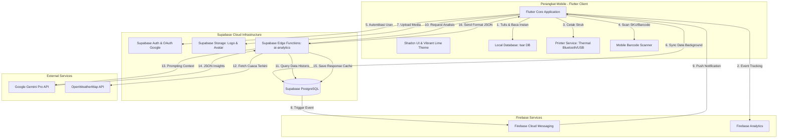

# PRODUCT REQUIREMENT DOCUMENT (PRD)
## PARZELLO POS MOBILE (ZELLOPOS)
**Sistem Aplikasi Kasir Offline-First Pintar Berbasis Flutter, Supabase, Isar DB, & AI Smart Analytics**

---

## 1. PENDAHULUAN & RINGKASAN EKSEKUTIF

### 1.1 Latar Belakang & Visi Produk
**Parzello POS** (juga dikenal sebagai **ZelloPOS**) adalah aplikasi Point of Sale (POS) mobile premium yang dirancang khusus untuk memenuhi kebutuhan operasional merchant Usaha Mikro, Kecil, dan Menengah (UMKM) di sektor Ritel dan F&B (Food and Beverage). 

Visi utama dari Parzello POS adalah menghadirkan sistem kasir yang **sangat responsif, andal dalam segala kondisi jaringan (Offline-First), modern secara visual (Premium UX), serta cerdas dalam memberikan rekomendasi bisnis (AI-Powered)**. Aplikasi ini dibangun menggunakan Flutter untuk performa cross-platform maksimal dengan backend Supabase, database lokal Isar DB untuk ketahanan offline, dan Google Gemini Pro API untuk analisis prediktif bisnis.

### 1.2 Proposisi Nilai Utama (Key Value Propositions)
1. **Offline-First & Auto-Sync Engine**: Menjamin operasional kasir tetap berjalan 100% tanpa hambatan saat koneksi internet terputus. Seluruh transaksi disimpan secara lokal di Isar DB dan disinkronisasikan ke Supabase secara otomatis saat koneksi kembali online.
2. **Premium Bento-Grid & Visual UX**: Antarmuka modern yang terstandarisasi menggunakan *Shadcn UI* dengan skema warna *Vibrant Lime* (`#9AE600`), tata letak bento-grid yang elegan, *floating rounded AppBars*, *bouncing physics*, serta getaran haptik (*haptic feedback*) untuk interaksi pengguna yang memuaskan.
3. **AI Smart Analytics (Gemini Powered)**: Fitur ramalan penjualan (*sales forecasting*), estimasi kunjungan pelanggan (*traffic prediction*), manajemen penentuan harga cerdas (*smart pricing*), serta prediksi produk terlaris berdasarkan cuaca dan tren historis.
4. **Real-Time Notification Hub**: Notifikasi otomatis di tingkat sistem maupun *broadcast* dari cloud (Firebase Cloud Messaging) yang terintegrasi dengan database trigger untuk mengawasi kondisi kritis toko (seperti stok menipis atau pembatalan transaksi).
5. **Multi-Store & Role-Based Access Control (RBAC)**: Kemampuan mengelola banyak outlet sekaligus dan pembatasan hak akses yang ketat antara Pemilik (*Owner/Admin*) dan Karyawan (*Cashier/Staff*).
6. **Seamless Hardware Integration**: Integrasi pencetakan struk belanja secara instan melalui printer thermal Bluetooth/USB (ukuran kertas 58mm/80mm) disertai kustomisasi *header/footer* struk secara dinamis.

---

## 2. ARSITEKTUR SISTEM & ALUR DATA

Sistem ini didesain menggunakan pendekatan arsitektur terdistribusi yang memisahkan beban operasional kasir harian (lokal) dengan beban pemrosesan data analitik dan penyimpanan awan (cloud).

### 2.1 Diagram Alur Komunikasi Data

### 2.2 Arsitektur Offline-First & Sync Engine
* **Penyimpanan Lokal Aktif**: Saat kasir melakukan checkout transaksi atau menambahkan produk baru, aplikasi tidak menunggu respon server. Data langsung ditulis ke **Isar DB** dengan flag `isSynced = false`.
* **Deteksi Konektivitas**: Modul `connectivity_plus` memantau kondisi jaringan secara real-time. 
* **Latar Belakang Sinkronisasi (`SyncNotifier` via Riverpod)**:
  - Ketika perangkat beralih dari status *offline* ke *online* dan sesi pengguna terverifikasi, sync engine akan memicu proses pengiriman data.
  - Urutan sinkronisasi dirancang berdasarkan relasi data (*dependency order*): 
    1. Kategori (`syncCategories`)
    2. Produk (`syncProducts` - termasuk mengunggah gambar lokal ke Supabase Storage)
    3. Transaksi (`syncTransactions` - dieksekusi via RPC PostgreSQL `create_transaction_v4` untuk menjaga konsistensi stok)
    4. Riwayat Stok (`syncStockHistory`)
  - Setelah server berhasil memproses data, status lokal diperbarui menjadi `isSynced = true`.

---

## 3. MODEL DATA & SKEMA DATABASE LOKAL (ISAR DB SCHEMA)

Untuk mendukung kestabilan sinkronisasi dan akses offline, berikut adalah skema tabel lokal (koleksi Isar DB) yang diimplementasikan pada aplikasi Parzello POS:

### 3.1 Koleksi `Product`
Menyimpan katalog menu atau produk dagangan milik toko.
* `id` (Id): Auto-increment primary key lokal.
* `supabaseId` (String, Indexed Unique): UUID produk di database cloud Supabase.
* `storeId` (String): ID toko pemilik produk.
* `name` (String): Nama produk.
* `description` (String, Nullable): Deskripsi produk.
* `price` (Double): Harga jual produk ke pelanggan.
* `modalPrice` (Double, Nullable): Harga pokok pembelian (modal) untuk kalkulasi profitabilitas.
* `stockQuantity` (Int, Indexed): Jumlah stok produk saat ini.
* `sku` (String, Nullable): Stock Keeping Unit produk.
* `barcode` (String, Nullable, Indexed): Kode barcode produk untuk pemindaian.
* `imageUrl` (String, Nullable): URL gambar produk di Supabase Storage.
* `categoryId` (String, Nullable, Indexed): ID kategori produk.
* `localImagePath` (String, Nullable): Path file gambar sementara pada penyimpanan lokal perangkat sebelum disinkronkan.
* `updatedAt` (DateTime, Nullable): Waktu pembaruan terakhir.
* `isSynced` (Bool, Indexed): Flag penanda apakah data lokal sudah sesuai dengan server.
* `isDeleted` (Bool): Menandakan produk sedang dalam antrean hapus di server.
* `syncError` (String, Nullable): Menyimpan pesan error jika sinkronisasi gagal.

### 3.2 Koleksi `Category`
Mengelompokkan produk ke dalam kategori tertentu.
* `id` (Id): Auto-increment primary key.
* `supabaseId` (String, Indexed Unique): ID kategori di Supabase.
* `storeId` (String): ID toko.
* `name` (String): Nama kategori (contoh: *Makanan*, *Minuman*, *Dessert*).
* `updatedAt` (DateTime, Nullable): Waktu pembaruan terakhir.
* `isSynced` (Bool, Indexed): Status sinkronisasi cloud.
* `isDeleted` (Bool): Status penghapusan.
* `syncError` (String, Nullable): Pesan error sinkronisasi.

### 3.3 Koleksi `Store`
Menyimpan informasi outlet atau toko yang aktif.
* `id` (Id): Auto-increment primary key.
* `supabaseId` (String, Indexed Unique): ID toko di Supabase.
* `name` (String): Nama toko.
* `address` (String, Nullable): Alamat fisik toko.
* `phone` (String, Nullable): Nomor kontak toko.
* `logoUrl` (String, Nullable): Tautan logo toko.
* `ownerId` (String): ID pengguna pemilik toko.
* `inviteCode` (String, Nullable): Kode unik untuk mengundang staf gabung ke toko.
* `settings` (String, Nullable): Metadata konfigurasi toko dalam bentuk JSON String (misal: setelan pajak, tipe bisnis).
* `userRole` (String, Nullable): Role pengguna aktif di toko tersebut (Owner/Kasir).
* `updatedAt` (DateTime, Nullable): Waktu pembaruan terakhir.

### 3.4 Koleksi `TransactionLocal`
Menyimpan ringkasan transaksi penjualan yang dilakukan kasir.
* `id` (Id): Auto-increment primary key.
* `supabaseId` (String, Indexed Unique): ID unik transaksi (UUID).
* `storeId` (String): ID toko tempat transaksi terjadi.
* `cashierId` (String): ID kasir yang memproses transaksi.
* `totalAmount` (Double): Total nilai akhir transaksi belanja.
* `paymentMethod` (String): Metode pembayaran (Cash, QRIS, Transfer, Debit).
* `cashPaid` (Double): Jumlah uang tunai yang dibayarkan pelanggan.
* `changeAmount` (Double): Jumlah uang kembalian.
* `status` (String): Status transaksi (success, pending, void).
* `tableId` (String, Nullable): ID meja jika dikaitkan dengan sistem dine-in restoran.
* `discountTotal` (Double): Nilai potongan harga yang didapat dari voucher atau diskon manual.
* `voucherInfo` (String, Nullable): JSON String berisi informasi voucher yang digunakan (ID, kode, tipe diskon).
* `createdAt` (DateTime): Waktu transaksi dibuat.
* `isSynced` (Bool): Status pengiriman transaksi ke cloud.
* `syncError` (String, Nullable): Pesan error sinkronisasi transaksi.

### 3.5 Koleksi `TransactionItemLocal`
Menyimpan daftar item produk detail yang dibeli dalam satu transaksi.
* `id` (Id): Auto-increment primary key.
* `transactionSupabaseId` (String, Indexed): Mengacu pada `supabaseId` di tabel `TransactionLocal`.
* `productId` (String): ID produk yang dibeli.
* `productName` (String): Nama produk saat transaksi terjadi (mencegah perubahan nama historis).
* `unitPrice` (Double): Harga satuan produk saat transaksi terjadi.
* `quantity` (Int): Jumlah kuantitas barang yang dibeli.
* `subtotal` (Double): Total harga item (`unitPrice * quantity`).

### 3.6 Koleksi `StockHistoryLocal`
Mencatat log mutasi stok masuk dan keluar secara mendalam untuk audit inventaris.
* `id` (Id): Auto-increment primary key.
* `supabaseId` (String, Indexed Unique): ID log di Supabase.
* `storeId` (String): ID toko.
* `productId` (String, Nullable): ID produk terkait.
* `productName` (String): Nama produk terkait.
* `changeType` (String): Jenis perubahan stok (`sale` untuk penjualan POS, `manual_addition` untuk tambah stok, `manual_reduction` untuk pengurangan stok, `manual_adjustment` untuk koreksi stok).
* `quantityChange` (Int): Jumlah perubahan stok (+/-).
* `oldStock` (Int): Jumlah stok sebelum penyesuaian.
* `newStock` (Int): Jumlah stok setelah penyesuaian.
* `referenceId` (String, Nullable): ID referensi pendukung (misal: ID Transaksi untuk penjualan).
* `cashierId` (String, Nullable): ID pengguna yang melakukan perubahan stok.
* `createdAt` (DateTime): Waktu perubahan stok dilakukan.
* `isSynced` (Bool): Status sinkronisasi ke server.
* `syncError` (String, Nullable): Pesan error sinkronisasi.

### 3.7 Koleksi `NotificationLocalModel`
Menyimpan pesan notifikasi lokal agar dapat diakses secara offline.
* `id` (Id): Auto-increment primary key.
* `supabaseId` (String, Indexed Unique): ID notifikasi dari Supabase.
* `storeId` (String, Nullable): ID toko terkait.
* `userId` (String, Nullable): ID pengguna penerima notifikasi.
* `type` (String): Tipe notifikasi (`stock` untuk stok tipis, `transaction_void` untuk pembatalan, `info` untuk sistem).
* `title` (String): Judul pemberitahuan.
* `message` (String): Isi pesan detail pemberitahuan.
* `isRead` (Bool, Indexed): Status apakah notifikasi sudah dibaca.
* `createdAt` (DateTime, Nullable): Waktu pembuatan notifikasi.
* `imageUrl` (String, Nullable): Gambar pendukung notifikasi.
* `metadataJson` (String, Nullable): Informasi detail tambahan dalam format JSON string.

---

## 4. MATRIKS HAK AKSES (ROLE-BASED ACCESS CONTROL - RBAC)

Aplikasi Parzello POS menerapkan pembatasan hak akses yang ketat berdasarkan peran (*role*) pengguna untuk menjaga keamanan finansial dan kerahasiaan data bisnis toko.

### 4.1 Matriks Fitur & Hak Akses
| Modul / Fitur | Owner (Admin) | Cashier (Staff) | Batasan Teknis & Perilaku Sistem |
| :--- | :---: | :---: | :--- |
| **Autentikasi & Pilih Toko** | ✅ | ✅ | Semua pengguna wajib login. Pemilik bisa membuat toko baru, kasir bergabung menggunakan kode undangan. |
| **Point of Sale (POS)** | ✅ | ✅ | Antarmuka kasir utama untuk memilih produk dan checkout transaksi. |
| **Pencarian & Barcode POS** | ✅ | ✅ | Pemindaian barcode SKU via kamera HP untuk entri transaksi cepat. |
| **Riwayat Transaksi** | ✅ | ✅ | Kasir hanya bisa melihat daftar transaksi harian, tidak bisa menghapus/mengubah transaksi. |
| **Manajemen Produk & Kategori** | ✅ | ❌ | Tambah, ubah, atau hapus menu serta kategori hanya bisa dilakukan oleh Owner. Tombol ditutup di UI kasir. |
| **Laporan & Analitik Keuangan** | ✅ | ❌ | Dashboard omzet, laba kotor, dan performa keuangan bulanan ditutup total bagi kasir. |
| **Smart Analytics (AI Powered)** | ✅ | ❌ | Prediksi omzet, rekomendasi harga diskon cerdas hanya untuk Owner demi strategi bisnis. |
| **Manajemen Staf** | ✅ | ❌ | Fitur menambah atau memberhentikan kasir dari toko. |
| **Pengaturan Informasi Toko** | ✅ | ❌ | Mengubah nama, alamat, nomor telepon, dan mengunggah logo toko. |
| **Pengaturan Struk & Printer** | ✅ | ✅ | Kustomisasi struk (logo, header, footer) hanya untuk Owner, namun setup printer Bluetooth diizinkan bagi kasir untuk cetak struk harian. |
| **Manajemen Stok Manual** | ✅ | ❌ | Koreksi stok manual (*stock adjustment*) diblokir untuk kasir. Kasir hanya memotong stok secara otomatis melalui transaksi penjualan. |

### 4.2 Proteksi Tingkat Routing & UI Controls
* **Route Guard (`GoRouter`)**: Jika kasir mencoba memasukkan URL navigasi secara manual ke halaman `/reports` atau `/settings/staff`, sistem akan mendeteksi role pengguna di level middleware router dan otomatis mengalihkan (*redirect*) ke dashboard kasir atau menampilkan halaman akses ditolak.
* **UI Dynamic Hiding**: Tombol "Tambah Produk", "Ubah Stok", dan menu "Laporan" pada bilah navigasi utama (`AppDrawer` atau `GoogleNavBar`) otomatis disembunyikan jika role pengguna aktif adalah `Cashier`.

---

## 5. SPESIFIKASI FITUR UTAMA & KEBUTUHAN FUNGSIONAL

### 5.1 F-01: Modul Autentikasi & Manajemen Toko
* **Registrasi & Login**: Keamanan tingkat tinggi menggunakan **Supabase Auth** dengan opsi login via Email + Password atau integrasi sekali klik **Google Sign-In**.
* **Setup Password**: Alur pemulihan akun yang aman dengan validasi email dan pembuatan ulang sandi baru secara instan.
* **Store Selection (Pilih Toko)**: 
  - Jika pengguna memiliki lebih dari satu toko, sistem menampilkan daftar toko dengan kartu *bento-grid* yang elegan.
  - Setiap toko dilengkapi dengan indikator peran (*role badge*) seperti "Owner" atau "Kasir".
  - Scroll list halus menggunakan `BouncingScrollPhysics`.
  - Tombol aksi utama "Gabung Toko Baru" (menggunakan kode undangan) dan "Buat Toko Baru" diletakkan di *sticky bottom footer* agar tidak tertutup konten.
* **Informasi Toko**: 
  - Owner dapat mengedit nama toko, alamat, dan telepon yang disusun dalam kartu modern.
  - **Logo Picker Premium**: Mendukung pengambilan gambar logo via kamera atau galeri asli (*native image picker*) dengan bingkai lingkaran squircular, yang otomatis diunggah ke *Supabase Storage* dan disinkronisasikan instan.

### 5.2 F-02: Modul Point of Sale (POS) Kasir
* **Katalog Produk Cepat**: 
  - Menampilkan daftar produk dengan loading transisi *skeleton shimmer*.
  - Dilengkapi fitur pencarian pintar dengan **Debouncing (300ms)** untuk mencegah lag saat kasir mengetik nama produk.
  - Menyediakan filter produk berdasarkan kategori secara dinamis.
  - Tombol ikonik kasir dilengkapi **Tooltips** penjelas guna mempermudah operasional kasir baru.
* **Keranjang Belanja (Cart Sheet)**:
  - Bottom sheet interaktif untuk melihat item yang dipilih, menambah/mengurangi kuantitas secara responsif.
  - Kalkulasi otomatis subtotal, pajak, diskon voucher, dan total belanja dihitung secara lokal.
  - Pemasangan voucher diskon (`apply_voucher`) atau diskon manual rupiah/persen (`apply_discount`) dengan validasi otomatis.
* **Fleksibilitas Metode Pembayaran (Checkout)**:
  - Mendukung metode pembayaran Tunai (Cash), QRIS Dinamis, Debit, dan Transfer Bank.
  - Input jumlah uang tunai yang dibayarkan pelanggan dengan tombol cepat (uang pas, Rp50.000, Rp100.000, dll.) dan kalkulasi kembalian otomatis.
  - **Fitur Penjualan Stok Kosong**: Toko ritel/F&B dapat mengaktifkan penjualan produk meskipun stok berstatus `0` atau minus demi kelancaran operasional (fleksibilitas pencatatan penjualan).
* **Split Bill**: Fitur pemisahan tagihan belanja pelanggan berdasarkan jumlah orang (`split_count`) dengan perhitungan matematis presisi dan pembagian struk terpisah.
* **Dine-In & Manajemen Meja**:
  - Mengintegrasikan nomor meja pada pesanan.
  - Layar pemantauan meja (`TableMonitoringScreen`) untuk memantau status pesanan meja yang aktif (*Dine-in ongoing*) secara real-time.

### 5.3 F-03: Manajemen Produk & Kategori
* **Katalog Manajemen**: Menampilkan daftar produk dengan visualisasi gambar, harga beli (modal), harga jual, sisa stok, dan label kategori terkait.
* **Barcode SKU**: Fitur pemindaian barcode SKU instan menggunakan kamera ponsel (`mobile_scanner`) baik saat kasir mencari produk di POS maupun saat menginput barcode di form tambah produk baru.
* **Manajemen Kategori Terpadu**:
  - Pendaftaran kategori baru untuk mempermudah organisasi katalog.
  - Halaman **Kategori Produk Terintegrasi**: Memungkinkan Owner melihat daftar produk yang ditautkan ke kategori tertentu secara langsung.
  - Memberikan label visual `"Tanpa Kategori"` di daftar produk untuk barang yang belum dikelompokkan agar database tetap rapi.

### 5.4 F-04: Manajemen & Riwayat Stok
* **Edit Stok Cepat (UX Moderen)**:
  - Mengganti input angka inline yang rawan salah klik dengan tombol utama "Ubah Stok" per produk.
  - Tombol tersebut akan membuka **Modal Bottom Sheet Interaktif** yang memaksa konfirmasi sadar dari Owner sebelum stok diperbarui.
  - Mendukung penyesuaian stok dengan tipe: Tambah Stok (masuk), Kurang Stok (keluar/rusak), atau Setel Ulang (penyesuaian manual).
* **Riwayat Stok (Stock History Screen)**:
  - Menyediakan log komprehensif dari seluruh mutasi stok barang masuk dan keluar.
  - Setiap log mencatat: nama produk, jumlah perubahan (+/-), stok lama, stok baru, nama kasir/owner pelaku penyesuaian, waktu transaksi, dan tipe mutasi (`sale`, `manual_addition`, dll.) untuk audit inventaris yang transparan.

### 5.5 F-05: Smart Analytics (AI Powered)
Modul dashboard analitik premium yang menggabungkan kecerdasan buatan Google Gemini Pro dan OpenWeatherMap API untuk memberikan wawasan operasional tingkat lanjut kepada pemilik toko.
* **Sales Forecasting (Ramalan Penjualan)**: 
  - Menampilkan estimasi nominal omzet harian, mingguan, atau bulanan berikutnya.
  - Visualisasi menggunakan **Grafik Garis (`fl_chart`)**: Garis tebal solid merepresentasikan data penjualan riil historis, sedangkan garis putus-putus (*dotted line*) berwarna neon melambangkan proyeksi masa depan dari AI.
* **Smart Traffic Prediction (Prediksi Kunjungan)**: Estimasi jumlah kunjungan pelanggan per jam (distribusi beban transaksi harian) untuk membantu alokasi jadwal shift kerja staf kasir secara efisien.
* **Smart Pricing (Rekomendasi Promosi)**:
  - AI menganalisis data perputaran barang mati/lambat (*deadstock*) dan jam-jam sepi transaksi (*idle hours*).
  - Menampilkan kartu rekomendasi promosi (misal: "Diskon 15% Happy Hour Donat Cokelat besok jam 14.00-16.00").
  - **Actionable Call-to-Action (CTA)**: Tombol `"Terapkan Promo"` di UI analitik akan otomatis mendaftarkan diskon/voucher tersebut ke sistem POS secara instan tanpa perlu input manual.
* **Best-Seller Prediction (Prediksi Produk Terlaris)**:
  - Memprediksi produk mana yang akan paling laku besok atau minggu depan.
  - Menggabungkan wawasan cuaca (misal: "Cuaca besok diprediksi panas terik 34°C, es krim mangga dan minuman segar diproyeksikan naik penjualan hingga 40%").
  - Menampilkan skor tingkat akurasi prediksi (*confidence score*).

### 5.6 F-06: Pusat Notifikasi (Notification Hub)
Sistem notifikasi 3-tingkat untuk menjamin kelancaran komunikasi operasional toko:
1. **In-App Toast (Feedback Instan)**: Animasi notifikasi interaktif menggunakan `delightful_toast` di bagian atas layar untuk umpan balik cepat (misal: koneksi offline, barang masuk keranjang).
2. **Local Notifications**: Pemicu dari sistem internal HP (menggunakan `flutter_local_notifications`) untuk memberi peringatan sistem penting seperti printer thermal terputus atau kegagalan kertas printer.
3. **Remote Push Notifications (FCM)**:
  - Terintegrasi dengan **Supabase Database Triggers & Edge Functions**.
  - **Trigger Otomatis Stok Menipis**: Ketika transaksi memotong stok produk di bawah batas aman (`min_stock_level`), server secara otomatis menyisipkan notifikasi tipe `stock` ke database, lalu Edge Function mengirim push notification ke perangkat Owner melalui FCM HTTP v1 API.
  - **Trigger Alert Void**: Mengirim notifikasi keamanan ke HP Owner saat staf kasir membatalkan/void transaksi yang sudah berjalan.
  - **Notification Center Screen**: Pusat pesan di dalam aplikasi yang merangkum semua notifikasi masuk secara urutan kronologis tanggal, dilengkapi titik merah (*unread badge dot*) dan fitur swipe-to-dismiss.
  - **Deep-Link Navigation**: Mengetuk notifikasi stok tipis akan langsung membuka halaman manajemen produk terkait.

### 5.7 F-07: Pengaturan Printer & Sinkronisasi
* **Setup Printer Thermal**:
  - Koneksi mulus ke printer thermal struk belanja via Bluetooth atau USB menggunakan driver `blue_thermal_printer`.
  - Mendukung pilihan ukuran kertas standar thermal POS, yakni **58mm** dan **80mm**.
  - Menyediakan fitur *Print Test Page* untuk kalibrasi instan.
* **Kustomisasi Struk Dinamis**: Halaman pengaturan khusus untuk mengustomisasi tampilan cetak struk: menyertakan logo toko, menuliskan teks pembuka (*header*), pesan penutup (*footer*), serta informasi sosial media toko secara fleksibel.
* **Sync Monitoring Dashboard**:
  - Menyediakan visibilitas penuh bagi pengguna mengenai status database lokal.
  - Menampilkan jumlah kategori, produk, transaksi, dan riwayat stok yang masih tertahan secara lokal (belum tersinkronisasi).
  - Menyediakan log daftar error sinkronisasi terakhir secara detail.
  - Tombol raksasa **"Sinkronkan Sekarang"** untuk memicu sinkronisasi paksa secara manual.
  - **Indikator Global**: Icon awan sinkronisasi (*Cloud Sync Icon*) dinamis di AppBar kasir yang berwarna merah jika ada data offline tertinggal dan berubah menjadi hijau centang saat semua data telah sinkron ke cloud.

---

## 6. KRITERIA NON-FUNGSIONAL (NON-FUNCTIONAL REQUIREMENTS - NFR)

### 6.1 Kinerja & Responsivitas (Performance & Responsiveness)
* **Debounced Inputs**: Pencarian produk di POS wajib menggunakan mekanisme *debouncer* minimal 300ms untuk menghindari beban rendering berlebih di UI dan menjaga kecepatan ketikan kasir tetap mulus.
* **Lazy Loading & Pagination**: Tampilan riwayat transaksi harian dan laporan barang harus dimuat secara bertahap (*infinite scroll*) untuk menghemat memori perangkat.
* **Hemat Bandwidth**: Sinkronisasi latar belakang hanya mengirimkan data terkompresi dengan format JSON ringan.

### 6.2 Ketahanan & Kompatibilitas Offline (Offline Resilience)
* **Wajib Online Pertama Kali**: Aplikasi mewajibkan koneksi internet pada penggunaan pertama kali setelah login (*Store Initialization*) untuk mengunduh baseline data toko. Jika lokal kosong dan offline, aplikasi akan memblokir layar dan meminta koneksi internet.
* **Background Auto-Retry**: Sync engine harus melakukan upaya pengiriman ulang secara berkala jika terjadi kegagalan jaringan tanpa mengganggu operasional layar kasir yang sedang aktif.

### 6.3 Keamanan Data & Privasi (Security & Privacy)
* **Supabase Row Level Security (RLS)**: Seluruh tabel di Supabase wajib dilengkapi kebijakan RLS ketat. Pengguna hanya diizinkan membaca, menambah, atau memodifikasi data yang memiliki keterkaitan dengan `store_id` tempat mereka terdaftar sebagai member.
* **Proteksi Data Pribadi (PII)**: Untuk fitur AI Smart Analytics, payload transaksi yang dikirimkan ke Google Gemini API **sama sekali tidak boleh** mengandung informasi identitas pelanggan (seperti nama, nomor telepon, kartu kredit). AI hanya menerima kuantitas produk, kategori, total harga, jam transaksi, dan parameter eksternal seperti cuaca.
* **Session Token Verification**: Aplikasi melakukan validasi token sesi Supabase secara berkala sebelum melakukan sinkronisasi untuk mencegah injeksi data dari sesi kedaluwarsa.

### 6.4 Usabilitas & Estetika (Usability & Premium UX)
* **Shadcn UI Standard**: Seluruh komponen masukan (*input fields*), tombol (*buttons*), dialog modal, dan kartu informasi harus mematuhi panduan desain Shadcn UI dengan lekukan sudut bulat konsisten.
* **Dynamic Scaffold Integration**: AppBar melayang transparan menggunakan properti `extendBodyBehindAppBar = true` pada Scaffold agar visualisasi scrolling konten di belakang header terlihat mewah dan mulus.
* **Haptic Feedback**: Getaran taktil yang tegas pada setiap aksi penting seperti checkout berhasil, scan barcode sukses, atau peringatan error untuk meningkatkan kepuasan penggunaan kasir.

---

## 7. MATRIKS ANALITIK & PELACAKAN REAL-TIME (FIREBASE EVENTS)

Pelacakan analitik diintegrasikan secara menyeluruh menggunakan **Firebase Analytics** untuk membantu pemantauan operasional, analisis perilaku merchant, dan evaluasi performa bisnis.

### 7.1 Matriks Pelacakan Peristiwa (Analytics Event Matrix)

| Modul / Layar | Nama Peristiwa (Event Name) | Parameter Utama | Pemicu Tindakan (Trigger Event) |
| :--- | :--- | :--- | :--- |
| **Produk & Inventaris** | `create_product` | `category_name`, `price`, `has_image` | Ketika Owner berhasil menyimpan produk baru. |
| | `update_product` | `price_changed` (bool), `stock_changed` (bool) | Ketika Owner memperbarui detail produk. |
| | `delete_product` | `category_name` | Ketika Owner menghapus produk dari katalog. |
| | `create_category` | `category_name` | Ketika Owner membuat kategori baru. |
| | `adjust_stock` | `product_name`, `adjustment_type`, `quantity` | Ketika Owner melakukan penyesuaian stok manual di bottom sheet. |
| **POS & Penjualan** | `purchase` | `transaction_id`, `value` (total), `payment_method` | Ketika kasir berhasil menyelesaikan transaksi checkout. |
| | `apply_voucher` | `voucher_code`, `discount_amount`, `voucher_type` | Ketika kasir berhasil memasang kode voucher belanja di keranjang. |
| | `apply_discount` | `discount_type` (persen/nominal), `amount` | Ketika kasir memberikan potongan harga manual. |
| | `split_bill` | `table_number`, `original_amount`, `split_count` | Ketika kasir membagi bill transaksi menjadi beberapa bagian. |
| | `print_receipt` | `printer_connection`, `is_reprint` (bool) | Ketika kasir mencetak struk thermal ke printer. |
| | `table_monitoring_view` | `active_tables_count`, `waiting_orders_count` | Ketika kasir membuka tab pemantauan meja dine-in. |
| **Kitchen System** | `kds_start_cooking` | `order_id`, `item_count` | Ketika koki dapur men-tap pesanan untuk mulai dimasak. |
| | `kds_order_ready` | `order_id`, `preparation_duration_seconds` | Ketika koki dapur menandai masakan telah selesai dimasak. |
| | `kds_order_served` | `order_id` | Ketika pramusaji mengonfirmasi pesanan telah diantar ke meja pelanggan. |
| **Pengaturan & Staf** | `add_staff` | `staff_role` | Ketika Owner menambahkan kasir/karyawan baru ke toko. |
| | `receipt_customization`| `show_logo` (bool), `header_customized` (bool) | Ketika Owner menyimpan setelan kustomisasi struk belanja. |
| | `force_manual_sync` | `unsynced_items_count` | Ketika pengguna memicu sinkronisasi offline paksa secara manual. |
| | `printer_setup_success`| `printer_model`, `connection_type` | Ketika printer thermal berhasil ditautkan dan terkalibrasi. |
| **Notifikasi & Info** | `send_broadcast` | `notification_type`, `target_role` | Ketika Owner mengirimkan pesan broadcast pengumuman toko ke semua staf. |
| | `tap_notification` | `notification_type` | Ketika pengguna mengetuk notifikasi di system tray atau pusat notifikasi. |

### 7.2 Status Implementasi Analitik
* **MODUL 1 & 2 (Produk, Inventaris, POS, Penjualan)**: **100% SELESAI** diimplementasikan dalam kode produksi (menggunakan `AnalyticsService` singleton).
* **MODUL 3, 4, & 5 (KDS, Staff, Notifikasi)**: Terdaftar dalam rencana peta jalan (*roadmap*) berikutnya seiring dengan implementasi penuh perangkat keras Kitchen Display System.

---
*Dokumen Kebutuhan Produk (PRD) ini dibuat secara otomatis berdasarkan analisis mendalam terhadap basis kode dan rencana pengembangan terintegrasi di dalam proyek Parzello POS Mobile.*
