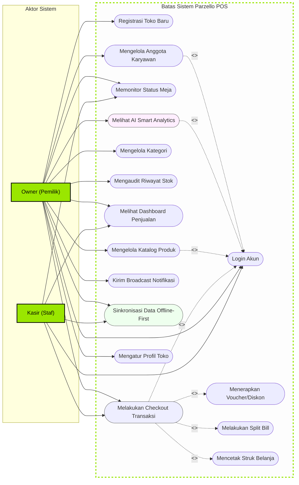

# Dokumentasi Use Case Diagram & Skenario Sistem
**Aplikasi: Parzello POS Mobile (ZelloPOS)**  
**Tanggal Penyusunan: 1 Juni 2026**

---

## Pendahuluan

Dokumen ini merinci model **Use Case Diagram** beserta skenario spesifikasi fungsional untuk aplikasi **Parzello POS Mobile**. Pemodelan ini bertujuan untuk menjabarkan batasan sistem (*system boundary*), interaksi antara aktor (pengguna) dengan fungsionalitas sistem, serta relasi dependensi antar-fungsi (`<<include>>` dan `<<extend>>`).

Dokumen ini disusun menggunakan standar pemodelan perangkat lunak untuk mendukung penyusunan dokumen skripsi/akademis yang terstruktur dan siap uji.

---

## Aktor Sistem (System Actors)

Sistem Parzello POS mengidentifikasi tiga aktor utama yang berinteraksi dengan aplikasi:

1.  **Owner (Pemilik Toko)**: 
    Aktor dengan hak istimewa tertinggi (*super-user*). Owner mengontrol seluruh konfigurasi toko, manajemen katalog produk, data karyawan, laporan keuangan mendalam, audit stok, serta fitur proyeksi penjualan berbasis kecerdasan buatan (**AI Smart Analytics**).
2.  **Karyawan / Kasir**:
    Staf operasional harian toko. Staf kasir memiliki akses terbatas yang difokuskan pada pelayanan penjualan (POS), pencetakan struk belanja, monitoring status meja, penginputan mutasi stok barang, dan melihat ringkasan omzet harian terbatas khusus untuk shift hari ini saja.
3.  **Pelanggan (Customer - Opsional / Masa Depan)**:
    Aktor eksternal (diusulkan pada model masa depan) yang dapat memesan menu mandiri melalui pemindaian QR Code meja restoran dan melakukan pembayaran elektronik (*self-checkout*).

---

## Diagram Use Case Utama (Mermaid Flowchart)

Mermaid diagram berikut memodelkan sistem batas (*system boundary*) Parzello POS dengan memetakan asosiasi aktor ke setiap lingkaran *use case*, termasuk relasi ketergantungan `include` (fungsi yang wajib dijalankan) dan `extend` (fungsi opsional di bawah syarat tertentu).

---

## Spesifikasi Use Case (Kamus Use Case)

Daftar berikut merinci fungsi dari masing-masing *use case* yang digambarkan pada diagram di atas:

| ID | Nama Use Case | Aktor Utama | Deskripsi Singkat |
| :--- | :--- | :--- | :--- |
| **UC-01** | Registrasi Toko Baru | Owner | Mendaftarkan akun toko baru saat inisialisasi awal sistem. |
| **UC-02** | Login Akun | Owner, Kasir | Autentikasi pengguna menggunakan email dan kata sandi. |
| **UC-03** | Melakukan Checkout | Owner, Kasir | Memasukkan pesanan ke keranjang dan memproses transaksi bayar. |
| **UC-04** | Menerapkan Voucher | Owner, Kasir | Memasukkan kode promosi voucher belanja untuk memotong tagihan. |
| **UC-05** | Melakukan Split Bill | Owner, Kasir | Memecah pembayaran satu nota belanja menjadi beberapa bill. |
| **UC-06** | Mencetak Struk Belanja | Owner, Kasir | Mencetak struk transaksi fisik melalui printer thermal Bluetooth. |
| **UC-07** | Memonitor Status Meja | Owner, Kasir | Memantau keterisian meja kasir secara visual (*dormant*). |
| **UC-08** | Mengelola Katalog | Owner | Menambah, menyunting, dan menghapus produk atau stok barang. |
| **UC-09** | Mengelola Kategori | Owner | Mengatur pengelompokan menu katalog produk toko. |
| **UC-10** | Mengaudit Riwayat Stok | Owner | Melihat log keluar-masuk mutasi barang untuk mencegah fraud. |
| **UC-11** | Melihat Dashboard | Owner, Kasir | Memantau performa keuangan (Kasir dibatasi khusus hari ini). |
| **UC-12** | Melihat AI Analytics | Owner | Melihat proyeksi omzet cerdas berbasis Gemini AI (*simulated*). |
| **UC-13** | Kirim Broadcast Notif | Owner | Mengirim pesan push pemberitahuan real-time ke semua kasir. |
| **UC-14** | Sinkronisasi Data | Owner, Kasir | Menyinkronkan antrean transaksi offline lokal ke cloud Supabase. |
| **UC-15** | Mengelola Karyawan | Owner | Mendaftarkan, menangguhkan, atau mengubah peran staf kasir. |
| **UC-16** | Mengatur Profil Toko | Owner | Mengubah identitas nama toko, alamat, dan logo outlet. |

---

## Skenario Deskriptif Use Case (Use Case Scenarios)

Berikut adalah skenario alur kejadian (*flow of events*) rinci untuk tiga fungsionalitas paling krusial di dalam sistem Parzello POS:

### Skenario 1: Melayani Transaksi POS Kasir (UC-03)
*   **Aktor Utama**: Kasir / Owner
*   **Kondisi Awal (Pre-Condition)**: Kasir sudah berhasil masuk (login) ke aplikasi dan keranjang belanja dalam keadaan kosong.
*   **Kondisi Akhir (Post-Condition)**: Transaksi tersimpan secara lokal di database Isar, struk belanja dicetak, dan stok produk berkurang.

| Alur Utama (Normal Flow) - Aksi Aktor | Reaksi Sistem |
| :--- | :--- |
| 1. Kasir membuka modul Kasir (POS Screen). | 2. Sistem menampilkan katalog produk per kategori. |
| 3. Kasir mengetik SKU/nama produk di pencarian atau memindai barcode SKU menggunakan kamera native. | 4. Sistem menyaring katalog dan menampilkan produk yang dicari secara instan. |
| 5. Kasir mengetuk produk untuk dimasukkan ke keranjang belanja. | 6. Sistem menambahkan produk ke keranjang, mengalkulasi subtotal, dan memperbarui angka lencana keranjang belanja. |
| 7. Kasir membuka lembar keranjang belanja (*Cart Sheet*). | 8. Sistem menampilkan detail item belanjaan kasir. |
| 9. (Opsional) Kasir memasukkan voucher belanja. | 10. Sistem memotong nilai total tagihan sesuai kalkulasi voucher. |
| 11. Kasir menekan tombol "Bayar" dan memilih metode pembayaran (Tunai). | 12. Sistem membuka layar pembayaran dan meminta kasir memasukkan nominal uang diterima. |
| 13. Kasir memasukkan jumlah uang tunai yang diterima dan menekan "Konfirmasi Pembayaran". | 14. Sistem menghitung kembalian, menyimpan transaksi di Isar DB lokal, mengurangi stok produk di database lokal, dan menampilkan dialog transaksi sukses. |
| 15. Kasir menekan tombol "Cetak Struk". | 16. Sistem menyusun layout nota dan mengirimkannya ke printer Bluetooth thermal yang terhubung. |

---

### Skenario 2: Kalibrasi & Latihan AI Smart Analytics (UC-12)
*   **Aktor Utama**: Owner
*   **Kondisi Awal**: Owner berada di halaman laporan keuangan dan data transaksi toko memiliki minimal 20 entri riwayat penjualan baru.
*   **Kondisi Akhir**: Model forecasting Gemini AI terkalibrasi secara cloud dan grafik peramalan omzet terbaru tersaji secara lokal.

| Alur Utama (Normal Flow) - Aksi Aktor | Reaksi Sistem |
| :--- | :--- |
| 1. Owner menekan menu "Smart Analytics". | 2. Sistem mendeteksi halaman terkunci (*Locked Backdrop Blur*), lalu menampilkan pop-up persetujuan privasi data latihan AI (*Agreement Dialog*). |
| 3. Owner menekan tombol "Setuju & Mulai Latihan". | 4. Sistem menampilkan proses bar kalibrasi AI. |
| | 5. Sistem memproses data tren secara lokal, mengaburkan informasi pribadi pelanggan (PII), mengunggah rangkuman histori transaksi terenkripsi ke API cloud, memicu model Gemini Pro, menyimpan cache proyeksi di penyimpanan lokal, dan menampilkan status "Kalibrasi Sukses!". |
| | 6. Sistem menyajikan visualisasi grafik fluktuasi peramalan omzet harian/mingguan/bulanan, jam sibuk pelanggan, rekomendasi harga dinamis (*smart pricing*), dan estimasi menu terlaris. |

---

### Skenario 3: Sinkronisasi Data Otomatis di Latar Belakang (UC-14)
*   **Aktor Utama**: Owner / Kasir (Tidak sadar/Latar Belakang) atau dipicu Manual
*   **Kondisi Awal**: Perangkat sebelumnya dalam keadaan luring (*offline*) dan baru saja mendapatkan kembali koneksi internet (*online*).
*   **Kondisi Akhir**: Seluruh data transaksi lokal tersinkronkan ke Supabase Cloud dan status produk lokal diperbarui ke cloud.

| Alur Utama (Normal Flow) - Aksi Aktor | Reaksi Sistem |
| :--- | :--- |
| | 1. Sensor konektivitas mendeteksi status beralih ke *Online*. |
| | 2. Sistem meluncurkan modul `SyncNotifier` secara otomatis di latar belakang. |
| | 3. Sistem menyeleksi antrean kategori lokal yang bertanda `isSynced = false`, lalu melakukan *upsert* ke Supabase Cloud. Setelah sukses, disusul dengan sinkronisasi data produk luring. |
| | 4. Sistem menyeleksi transaksi luring lokal di Isar DB, menyusun payload RPC SQL, dan mengunggahnya ke tabel `transactions` dan `transaction_items` di Supabase. |
| | 5. Sistem menandai baris transaksi lokal dengan bendera `isSynced = true`. |
| | 6. Sistem memperbarui log mutasi stok produk di tabel `stock_histories` cloud agar audit stok tetap sinkron. |
| | 7. Sistem memicu pemberitahuan Toast sukses di layar perangkat: *"Sinkronisasi selesai! Data offline berhasil diunggah ke cloud."* |
